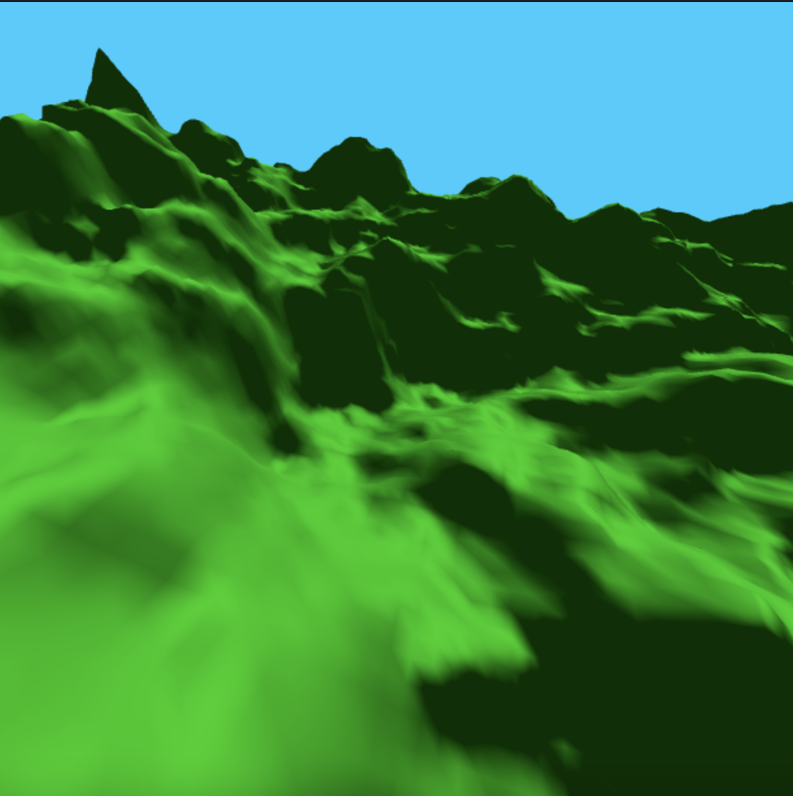

# flight-simulator
A flight simulator on a procedurally generated terrain.
You can use the arrow keys and the "wasd" keys to fly a drone around the terrain.
Made using WebGL.
Uses a Quadtree for collision detection.
Uses Blinn-Phong shading for lighting.
Includes a day and night cycle.



Instructions
===
Use the up and down arrow keys to move the drone forwards and backwards.
Use the left and right arrow keys to yaw,
the "w" and "s" keys to pitch,
and the "a" and "d" keys to roll.

Build
===
You can play the game on a browser by serving the static content locally.
You can do this by using python in the project's root directory:

```
python3 -m http.server
```

Then navigate to "localhost:PORT" in a browser.
PORT being whatever port http.server opened on (most likely 8000).
